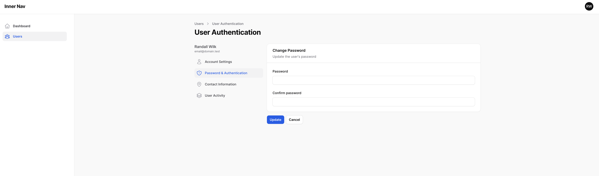
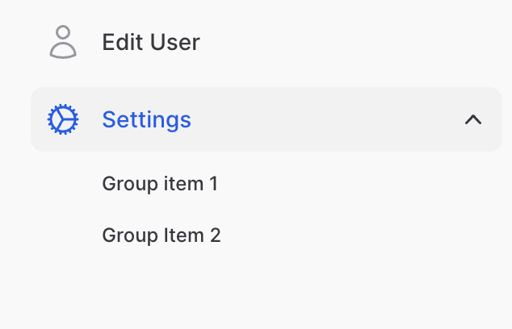
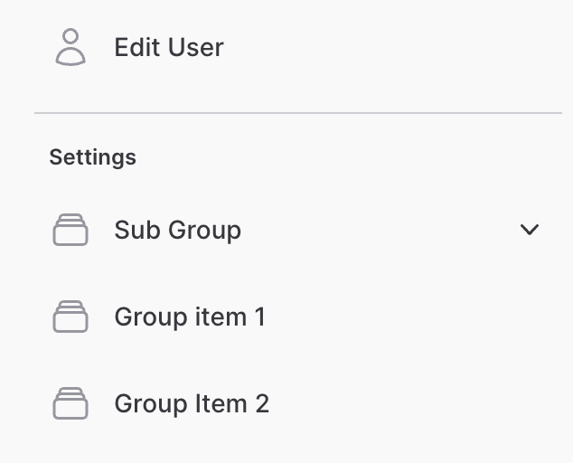
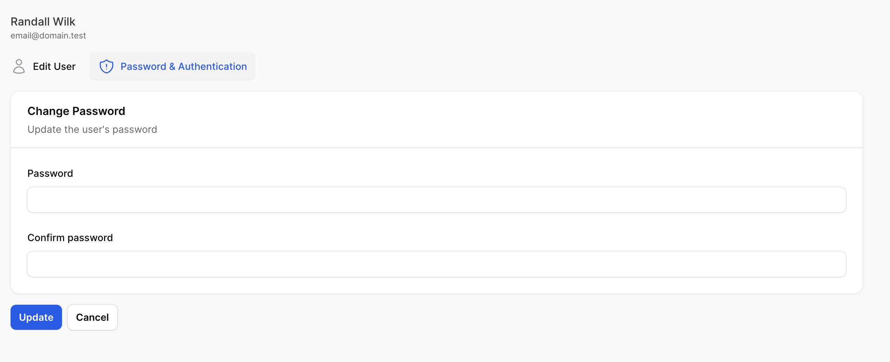

# filament-inner-nav

[](https://packagist.org/packages/rawilk/filament-inner-nav)

[](https://packagist.org/packages/rawilk/filament-inner-nav)
[](https://packagist.org/packages/rawilk/filament-inner-nav)
[](https://github.com/rawilk/filament-inner-nav/blob/main/LICENSE.md)


The `filament-inner-nav` package allows you to organize resource pages in your Filament panels into a group of "inner navigation" pages. This is useful for when you have a
resource page that has many sub-pages, such as when viewing/editing a user record.



## Installation

You can install the package via composer:

```bash
composer require rawilk/filament-inner-nav
```

You can publish the config file with:

```bash
php artisan vendor:publish --tag="filament-inner-nav-config"
```

You can view the default configuration here: https://github.com/rawilk/filament-inner-nav/blob/main/config/filament-inner-nav.php

The views can be published with:

```bash
php artisan vendor:publish --tag="filament-inner-nav-views"
```

## Usage

1. First, you need to generate a filament resource page and then add your custom resource pages to the array from `getPages`. For example, a `UserResource`:

    ```php
    use App\Filament\Resources\UserResource\Pages;
    use Filament\Resources\Resource;

    class UserResource extends Resource
    {
        // ...

        public static function getPages(): array
        {
            'index' => Pages\ListUsers::route('/'),
            'create' => Pages\CreateUser::route('/create'),
            'edit' => Pages\EditUser::route('/{record}/edit'),

            // custom pages...
            'authentication' => Pages\UserAuthentication::route('/{record}/authentication'),
            'contact' => Pages\Contact::route('/{record}/contact'),
            'activity' => Pages\Activity::route('/{record}/activity'),
        }

        // ...
    }
    ```

2. Define a `$record` property on each of your custom resource pages:
    ```php
    public ModelName $record; // public User $record;
    ```
    > Be sure to change `ModelName` to the class name of your model.
3. Define an `innerNav` static method on your resource:

    ```php
    use App\Models\User;
    use Filament\Resources\Resource;
    use Rawilk\FilamentInnerNav\InnerNav;
    use Rawilk\FilamentInnerNav\InnerNavItem;

    class UserResource extends Resource
    {
        // ...

        public static function innerNav(User $record): InnerNav
        {
            return InnerNav::make()
                ->setNavigationItems([
                    InnerNavItem::make('Edit User')
                        ->url(fn (): string => static::getUrl('edit', ['record' => $record])),
                    InnerNavItem::make('Password & Authentication')
                        ->url(fn (): string => static::getUrl('authentication', ['record' => $record])),
                    InnerNavItem::make('Contact Information')
                        ->url(fn (): string => static::getUrl('contact', ['record' => $record])),
                    InnerNavItem::make('Activity')
                        ->url(fn (): string => static::getUrl('activity', ['record' => $record])),
                ]);
        }
    }
    ```

4. In each of your custom pages, wrap the content inside of the `<x-filament-inner-nav::page>` blade component:
    ```html
    <!-- file: filament.resources.user-resource.pages.authentication -->
    <x-filament-panels::page>
        <x-filament-inner-nav::page>
            <!-- page content here -->
        </x-filament-inner-nav::page>
    </x-filament-panels::page>
    ```

> If the navigation isn't styled correctly, you may need to run `filament:upgrade` to ensure the latest assets are published.

## Advanced Usage

### Enable `wire:navigate`

Allow the usage of livewire's `wire:navigate` by using the `wireNavigate()` method on the `InnerNav` object:

```php
public static function innerNav(User $record): InnerNav
{
    return InnerNav::make()
        ->wireNavigate()
        ->setNavigationItems([
            // ...
        ]);
}
```

> This option can be globally configured in a service provider. See [Global Configuration](#global-configuration).

### Title & Description

You can set a title and/or description for the navigation via the `setTitle()` and `setDescription()` methods on the `InnerNav` object.
These will show up directly above the navigation items.

```php
public static function innerNav(User $record): InnerNav
{
    return InnerNav::make()
        ->setTitle('Nav title')
        ->setDescription('Nav description')
        ->setNavigationItems([
            // ...
        ]);
}
```

For more advanced customization, you may return an `HtmlString` object from a closure with either of these methods:

```php
public static function innerNav(User $record): InnerNav
{
    return InnerNav::make()
        ->setTitle(fn (): HtmlString => new HtmlString('<h1>' . $record->name . '</h1>'))
        ->setDescription(fn (): HtmlString => new HtmlString('<p>Nav description</p>'))
        ->setNavigationItems([
            // ...
        ]);
}
```

> You may also return a custom view using `view('...')` from the closure on the `title()` method if needed.

### Item Icons

You can set an icon for each navigation item via the `icon()` method on the `InnerNavItem` object:

```php
public static function innerNav(User $record): InnerNav
{
    return InnerNav::make()
        ->setNavigationItems([
            InnerNavItem::make('Edit User')
                ->url(fn (): string => static::getUrl('edit', ['record' => $record]))
                ->icon('heroicon-o-pencil'),
        ]);
}
```

### Item Active State

By default, active state is not set on any navigation item. You may call the `isActiveWhen()` method on the `InnerNavItem` object to set active state.

```php
public static function innerNav(User $record): InnerNav
{
    return InnerNav::make()
        ->setNavigationItems([
            InnerNavItem::make('Edit User')
                ->url(fn (): string => static::getUrl('edit', ['record' => $record]))
                ->isActiveWhen(fn (): bool => request()->route()->action['as'] === 'filament.resources.users.edit')
        ]);
}
```

### Item Visibility

Items can be hidden from the UI by calling either the `visible()` or `hidden()` methods on the `InnerNav` object.

```php
public static function innerNav(User $record): InnerNav
{
    return InnerNav::make()
        ->setNavigationItems([
            InnerNavItem::make('Edit User')
                ->url(fn (): string => static::getUrl('edit', ['record' => $record]))
                ->visible(fn (): bool => auth()->user()->can('edit', $record)),
        ]);
}
```

### Disabling Items

There may be cases where you still want to show the navigation link, but disable the user from actually visiting it. You may use the `isDisabledWhen()` method on the `InnerNavItem` object for this.

```php
public static function innerNav(User $record): InnerNav
{
    return InnerNav::make()
        ->setNavigationItems([
            InnerNavItem::make('Edit User')
                ->url(fn (): string => static::getUrl('edit', ['record' => $record]))
                ->isDisabledWhen(fn (): bool => ! auth()->user()->can('edit', $record)),
        ]);
}
```

### Item Badges

You may add a badge to any navigation item by calling the `badge()` method on the `InnerNavItem` object.

```php
public static function innerNav(User $record): InnerNav
{
    return InnerNav::make()
        ->setNavigationItems([
            InnerNavItem::make('Edit User')
                ->url(fn (): string => static::getUrl('edit', ['record' => $record]))
                ->badge('New'),
        ]);
}
```

### Groups

Items can be grouped in the navigation by using the `InnerNavGroup` object. A group can either be collapsible
or static. Collapsible groups can be nested inside a static group. Below will be an example of each group.

#### Collapsible Group

Collapsible groups allow you to nest a group of navigation items underneath a button that can toggle the visibility of the items.
The UI for this is inspired by how GitHub handles their sub navigation on your account settings pages.

```php
public static function innerNav(User $record): InnerNav
{
    return InnerNav::make()
        ->setNavigationItems([
            InnerNavItem::make('Edit User')
                ->url(fn (): string => static::getUrl('edit', ['record' => $record])),
            InnerNavGroup::make('Settings')
                ->icon('heroicon-o-cog')
                ->items([
                    InnerNavItem::make('Group item 1')
                        ->url('#'),
                    InnerNavItem::make('Group Item 2')
                        ->url('#'),
                ])
        ]);
}
```



**Note:** The `icon` method is optional on the `InnerNavGroup` object.

> `InnerNavItem` objects underneath an `InnerNavGroup` are not allowed to have an icon.

> By default, collapsible groups are collapsed. You can change this by calling the `expandByDefault()` method on the `InnerNavGroup` object.
> The group will also be expanded if any of the items inside it are set to active.

#### Static Groups

Also inspired by the GitHub UI, static groups allow you to render navigation links underneath a heading. All you need to do is provide
a falsy value to the `collapsible()` method on the `InnerNavGroup` object.

```php
public static function innerNav(User $record): InnerNav
{
    return InnerNav::make()
            ->setNavigationItems([
                InnerNavItem::make('Edit User')
                    ->url(fn () => self::getUrl('edit', ['record' => $record]))
                    ->icon('heroicon-o-user'),
                InnerNavGroup::make('Settings')
                    ->collapsible(false)
                    ->items([
                        InnerNavGroup::make('Sub Group')
                            ->icon('heroicon-o-rectangle-stack')
                            ->items([
                                InnerNavItem::make('Sub group item 1')
                                    ->url('#'),
                            ]),
                        InnerNavItem::make('Group item 1')
                            ->icon('heroicon-o-rectangle-stack')
                            ->url('#'),
                        InnerNavItem::make('Group Item 2')
                            ->icon('heroicon-o-rectangle-stack')
                            ->url('#'),
                    ]),
}
```



> Unlike with a collapsible group, the direct `InnerNavItem` children are allowed to have icons.

### Top Layout

If you want to render the links on top of your content, instead of on the side, you may use the `setLayout()` method on the `InnerNav` object:

```php
use Rawilk\FilamentInnerNav\Enums\InnerNavLayout;
use Rawilk\FilamentInnerNav\InnerNav;

public static function innerNav(User $record): InnerNav
{
    return InnerNav::make()
        ->setLayout(InnerNavLayout::Top)
        ->setNavigationItems([
            // ...
        ]);
}
```



> Any `InnerNavGroup` objects added with this layout will be rendered as a dropdown menu.

### Global Configuration

Many options on the `InnerNav`, `InnerNavItem`, and `InnerNavGroup` objects can be configured globally, typically in a service
provider somewhere.

```php
use Illuminate\Support\ServiceProvider;
use Rawilk\FilamentInnerNav\Enums\InnerNavLayout;
use Rawilk\FilamentInnerNav\InnerNav;
use Rawilk\FilamentInnerNav\InnerNavGroup;

class AppServiceProvider extends ServiceProvider
{
    public function boot(): void
    {
        InnerNav::configureUsing(function (InnerNav $nav) {
            $nav
                ->wireNavigate()
                ->setLayout(InnerNavLayout::Side);
        });

        InnerNavGroup::configureUsing(function (InnerNavGroup $group) {
            // Expand collapsible groups by default.
            $group->expandByDefault();
        });
    }
}
```

## Styling

Many parts of the UI provided by this package are prefixed with a custom CSS class you can hook into with your own styles to override the styling.
All class names will start with `fi-inner-nav-`, for example the navigation items all have a class of `fi-inner-nav-item`.

It is not practical to list and maintain all the class names used here, so if there's an element you want to style differently, you can either inspect
the element in your browser or view the source code of the blade components in this repository.

If there's an element that you need to style that doesn't have a custom class, you may submit a PR to add one, however I cannot guarantee that I will merge it.

## Scripts

### Setup

For convenience, you can run the setup bin script for easy installation for local development.

```bash
./bin/setup.sh
```

### Formatting

Although formatting is done automatically via workflow, you can format php code locally before committing with a composer script:

```bash
composer format
```

## Testing

```bash
composer test
```

## Changelog

Please see [CHANGELOG](CHANGELOG.md) for more information on what has changed recently.

## Contributing

Please see [CONTRIBUTING](.github/CONTRIBUTING.md) for details.

## Security

Please review [my security policy](.github/SECURITY.md) on how to report security vulnerabilities.

## Credits

-   [Randall Wilk](https://github.com/rawilk)
-   [All Contributors](../../contributors)

## Alternatives

Some alternatives to this package include:

-   [Filament Page With Sidebar](https://github.com/aymanalhattami/filament-page-with-sidebar)

If you have a similar package to this that you would like to add, please submit a PR with an updated README.

## License

The MIT License (MIT). Please see [License File](LICENSE.md) for more information.
